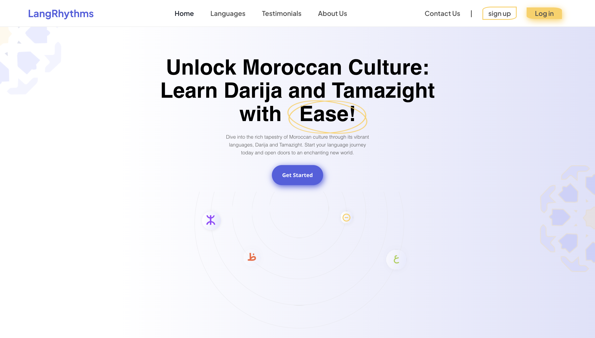

# LangRhythms
Welcome to LangRhythms, a foreign language learning website for language learners.

#### Video Demo:  Not Yet done
#### Description:
  
     Welcome to LangRhythms, a foreign language learning website for Learning Tamazight, Darija, and Arabic.





### What is this website for?
LangRhythms will help learners learn how to write and pronouce the different Amazigh and Arabic letters and help them advance their comprehension of the Moroccan Language Darija by accessing thousands of intercative and fun lessons.
### Why did you create this website?
We wanted to make a website where language learners (mostly beginner) can learn Arabic, Darija and Amazigh, because we did not find resources that help learners learn how to write letters.
As a result, I thought of building one that do just that.
### What did you use to build this website?
I used Python (Flask) for the backend, SQLite3 for database management, React for frontend.

---

## How to run this web app locally


#### The client site
## Scaffolding Your First Vite Project
Step 0: Install nodejs (we will be using npm)
Step 1: 
```console
$ npm create vite@latest
```
Step2:
```
cd client
```

Step3:
```
npm install
```
To the run the client side:
```
npm run dev
```

## BackEnd
### 1. Install the requirements within `requirements.txt` using pip


#### A) setup

Run the following commands:
1) Make sure that you've already installed python, sqlite3, and Flask. Then, write the following command:

```console
Run Flask
```


### 2. Want to contribute?

Thank you! That would be great. Please feel free to send any pull requests here.


# LangRhythms Contributing Guide

Want to contribute to LangRhythms? Don't know where to start? Don't feel ready to contribute? Read this!

## Table of contents

1. [Prequisites](#prerequisites)
2. [How To Contribute?](#how-to-contribute)
3. [Issues](#issues)
4. [Editing Code](#editing-code)

## Prerequisites

Contributing to LangRhythms doesn't require any prerequisites. Few resources that can help you get started with git, React and Typescript are listed below however, you can also reach out to us if you're struggling with anything and we'd be happy to guide you to the right direction. We expect you to use the resources and try and figure out issues on your own first as this is a learning opportunity.

- [Git Book](https://git-scm.com/book/en/v2)
- [Traversy Media React Crash Course](https://youtu.be/w7ejDZ8SWv8)
- [Traversy Media Typescript Crash Course](https://www.youtube.com/watch?v=BCg4U1FzODs)
- [Scrimba React Course](https://scrimba.com/learn/learnreact)

 
### 2. How to contribute?

To Contribute:
Read contributing documentation
To Install
- Fork and clone both repos
- npm install on each to install dependencies
- npm run dev on each to run the server


## Issues

All current open issues can be found [here](https://github.com/MefDev/LangRhythms/issues). Issues labeled `help wanted` are open issues you can snag and work on.

> Issues marked `good first issue`, as the label suggests, are beginner-level issues that are good for newcomers.

## Editing Code

LangRhythms is repo that contained the frontend and the bankend. Follow the guide below to make changes and submit a pull request.

### Repositories
1. Navigate to the [frontend repo](https://github.com/MefDev/LangRhythms/tree/main/backend-Flask)
2. Navigate to the [backend repo](https://github.com/MefDev/LangRhythms/tree/main/client)

### Forking

1. Navigate to the repositories listed above
2. Locate the `Fork` button on the top right hand side of the webpage just below your username icon
3. Click fork
4. Follow the same steps to fork both repositories


Once forked, you wil have copies of the repositositories, under your profile, to freely modify and make changes to the codebase.

### Cloning

1. Navigate to the forked repositories on your profile page
2. Locate and click the `Code` button above the list of files
3. On the menu pop up, click the clipboard icon and copy the HTTPS URL
4. Open a terminal on your machine and navigate to the directory where you want to clone the repositories
5. Type `git clone <HTTPS-URL>` replacing `<HTTPS-URL>` with the URL copied in step 3.
6. Press Enter
7. Repeat steps 1 through 6 for the second repository


Your project directory should now look like this:
Community Focus/
|-- backend-Flask
`-- client

### Installing Dependencies and Running Project Locally

LangRhythms uses a number of packages that are required to run the project. These packages are not pushed into the remote repository so you will need to install these dependencies to your local projects files.

1. Open a terminal on VS Code and cd to `client`
2. Open a split terminal and cd to `backend-Flask`
3. Run `npm install` on the client terminals - this will install all the dependencies to your local repository (you will see a node_modules folder pop up on each directory)
3. Run `pip install -r requirements.txt` on the backend terminals - this will install all the dependencies to your local repository.
5. Run `npm run dev` on to run the client app!
5. Run `Run Flask` on to run the backend app!
6. You will see a link in your terminal for the localhost port to open the app in your browser. It will look like `http://127.0.0.1:5100/`

### Making Changes

You're now all set to work on your assigned issue!

#### Changing Code

Make changes like you would on any other project. Once you've made the changes and tested them thoroughly, you're ready to push changes to your fork!

1. Make your changes
2. Test thoroughly
3. Run `npm run format <path-of-file(s)-you-changed>` - if you changed multiple files, please run this command separately for each file. This command runs prettier and formats the file(s) to Community Focus's configurations
4. Run `npm run lint`
5. Fix ESLint errors if any
6. Run `npm run test` for any unit tests to run. They should all pass. If not, you need to see why the test failed and fix either the code, or update the tests to reflect your code changes.
7. Commit your changes using `git commit -m "Commit-message"`
8. Push your changes to your fork using `git push`

#### Sending a Pull Request

Once you've pushed changes to your main branch, you will need to submit a pull request which is essentially a request for your changes to be merged to the original project.

1. Visit your GitHub profile and navigate to the repo where you made changes; either frontend, backend, or both
2. You will now see a "Compare & Pull Request" prompting you to create a pull request
3. Click on "Compare & Pull Request"
4. Fill the PR template describing the changes you made
5. A reviewer will be assigned to review your changes
6. Your changes will be merged after a reviewer approves your changes


### Syncing your fork on GitHub

Before making changes to your code, make sure to sync your fork. Syncing your fork will pull all the changes from the original project onto your fork. Once synced, run `git pull` on your local files to pull the changes from your remote repository to your local repository.
